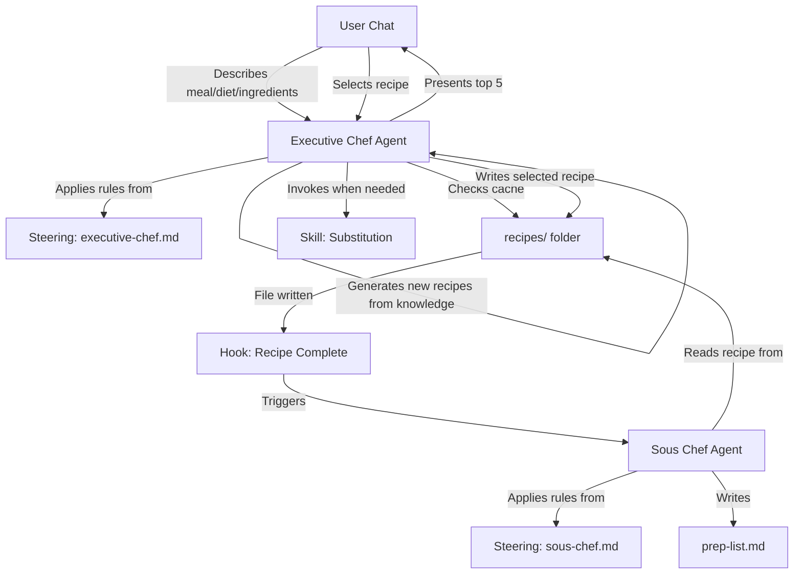

# Design Document: South Indian Executive Chef System

## Overview

The South Indian Executive Chef System is a conversational multi-agent Kiro workspace. The user chats with the Executive Chef Agent describing what they want (meal type, dietary needs, available ingredients), and the agent responds with top 5 recipe suggestions — mixing cached recipes from the `recipes/` folder with newly generated ones. When the user picks a recipe, it's saved to `recipes/` and a Kiro Agent Hook triggers the Sous Chef Agent to auto-generate `prep-list.md`. Substitutions are handled via a dedicated Kiro Skill.

## Architecture



### Conversational Flow

1. User opens Kiro chat and describes what they want:
   - "Help me with a simple breakfast recipe"
   - "I'm vegetarian, suggest something for dinner"
   - "I have urad dal, rice, and curry leaves — what can I make?"
2. Executive Chef Agent checks `recipes/` folder for cached recipes matching the request
3. Agent also generates new recipe options from its culinary knowledge
4. Agent presents top 5 suggestions as a numbered list (cached recipes marked as such)
5. User picks a recipe
6. If the recipe is new, agent generates the full recipe using the standard template and saves to `recipes/`
7. If the recipe is cached but dietary requirements differ, agent generates a new variant
8. Agent invokes Substitution Skill if any ingredient is unavailable
9. Kiro Agent Hook detects the recipe file write and triggers the Sous Chef Agent
10. Sous Chef generates `prep-list.md` with exact measurements and step-by-step instructions

## Components and Interfaces

### 1. Executive Chef Agent Steering File
- **Location**: `.kiro/steering/executive-chef.md`
- **Purpose**: Defines the Executive Chef's persistent conversational and culinary rules
- **Contents**:
  - Role definition: South Indian culinary expert and conversational recipe advisor
  - Conversational behavior: understand meal type, dietary requirements, and available ingredients from user messages
  - Regional authenticity rules: only individual spices, blocked ingredient list
  - Recipe suggestion format: present top 5 as numbered list with name, description, and cache indicator
  - Recipe caching logic: check `recipes/` folder first, generate new if no match or dietary mismatch
  - Output format: write recipes to `recipes/{recipe-name}.md` using the standard Recipe Template
  - Substitution invocation: reference to the Substitution Skill file when ingredients are unavailable
  - Error handling: inform user when no recipes match, when substitutions are unavailable

### 2. Sous Chef Agent Steering File
- **Location**: `.kiro/steering/sous-chef.md`
- **Purpose**: Defines the Sous Chef's persistent behavioral rules
- **Contents**:
  - Role definition: preparation and mise en place specialist
  - Input format: expects a recipe file following the standard Recipe Template
  - Output format: Markdown prep list with heading, ingredient table, numbered steps
  - Measurement standards: exact quantities, preparation actions per ingredient
  - Output location: write to `prep-list.md`

### 3. Substitution Skill
- **Location**: `.kiro/steering/skills/substitution-skill.md`
- **Purpose**: On-demand prompt template for finding authentic ingredient alternatives
- **Input**: Missing ingredient name, regional classification of the recipe
- **Output**: List of alternatives, each with name and conversion ratio
- **Contents**:
  - South Indian substitution mappings (e.g., tamarind → kokum/amchur, coconut milk → cashew paste)
  - Conversion ratio guidelines
  - Regional authenticity constraints for substitutions
  - Instruction to return empty list when no valid alternative exists

### 4. Agent Hook

#### Hook: Recipe Complete
- **Trigger**: A file is written or updated in the `recipes/` folder
- **Action**: Sends a message to the Sous Chef Agent: "A recipe has been saved. Read the recipe file and generate a prep-list.md with exact measurements and step-by-step preparation instructions."
- **Configuration**: File save event on `recipes/*.md`

### 5. Workspace Files

| File/Folder | Owner | Purpose |
|-------------|-------|---------|
| `recipes/` | Executive Chef Agent | Folder of cached recipe files |
| `recipes/{recipe-name}.md` | Executive Chef Agent | Individual recipe following the standard template |
| `prep-list.md` | Sous Chef Agent | Preparation instructions for the most recently selected recipe |
| `logs/transaction-log.md` | Both Agents | Append-only log of agent interactions with timestamps, files accessed, and decisions made |

### 6. Transaction Log Format (`logs/transaction-log.md`)

Each agent appends a structured entry after completing an interaction:

```markdown
## 2026-03-14 10:30 — Executive Chef

- **Request**: "Suggest a vegetarian breakfast"
- **Files read**: recipes/idli.md, recipes/dosa.md
- **Recipes suggested**: Idli (cached), Dosa (cached), Pongal (new), Upma (new), Medu Vada (new)
- **User selected**: Pongal
- **Files written**: recipes/pongal.md
- **Substitutions**: None
- **Errors**: None

---

## 2026-03-14 10:31 — Sous Chef

- **Recipe file read**: recipes/pongal.md
- **Files written**: prep-list.md
- **Errors**: None

---
```

## Data Models

### Standard Recipe Template (`recipes/{recipe-name}.md`)

All recipe files follow this consistent template:

```markdown
# Sambar

## Regional Classification
Tamil Nadu

## Dietary Tags
Vegetarian, Gluten-Free

## Ingredients
- 1 cup toor dal
- 2 tablespoons tamarind paste
- 1 teaspoon mustard seeds
- 1 teaspoon urad dal
- 10 curry leaves
- 2 dried red chilies
- 1/2 teaspoon turmeric powder
- Salt to taste

## Substitutions Applied
- Toor dal → Moong dal (ratio: 1:1)

## Steps
1. Wash and pressure cook toor dal until soft
2. Soak tamarind in warm water and extract pulp
3. Heat oil, add mustard seeds and let them splutter
4. Add urad dal, curry leaves, and dried red chilies
5. Add vegetables and cook until tender
6. Add tamarind extract and turmeric
7. Add cooked dal and simmer for 10 minutes
8. Season with salt
```

### Prep List Format (`prep-list.md`)

```markdown
# Prep List: Sambar

## Ingredients Prep
| Ingredient | Measurement | Preparation Action |
|-----------|-------------|-------------------|
| Toor dal | 1 cup | Wash and soak for 30 minutes |
| Tamarind paste | 2 tablespoons | Soak in 1/2 cup warm water |
| Mustard seeds | 1 teaspoon | Measure and set aside |
| Urad dal | 1 teaspoon | Measure and set aside |
| Curry leaves | 10 leaves | Wash and pat dry |
| Dried red chilies | 2 pieces | Break in half, remove seeds if less heat desired |
| Turmeric powder | 1/2 teaspoon | Measure and set aside |

## Steps
1. Wash toor dal thoroughly and soak for 30 minutes
2. Pressure cook dal with 2 cups water for 3 whistles
3. Soak tamarind in warm water for 15 minutes, extract pulp
4. Heat 2 tablespoons oil in a heavy-bottomed pan
5. Add mustard seeds, wait for spluttering
6. Add urad dal, fry until golden
7. Add curry leaves and dried red chilies, sauté for 30 seconds
8. Add chopped vegetables, cook for 5 minutes
9. Pour in tamarind extract and turmeric, simmer 10 minutes
10. Add mashed dal, mix well, simmer 10 more minutes
11. Adjust salt and consistency with water as needed
```

### Blocked Ingredients List

The following ingredients are prohibited in any recipe generated by the Executive Chef Agent:
- curry powder
- garam masala (generic blends)
- mixed spice powder
- all-purpose seasoning

### Substitution Mappings (Skill Reference Data)

| Missing Ingredient | Alternative | Conversion Ratio | Notes |
|-------------------|-------------|-------------------|-------|
| Tamarind | Kokum | 1:0.5 | Use half the quantity |
| Tamarind | Amchur (dry mango powder) | 1:0.3 | Use one-third the quantity |
| Coconut milk | Cashew paste | 1:0.75 | Blend cashews with water |
| Curry leaves | Bay leaves | 10:2 | Less aromatic, use sparingly |
| Mustard seeds | Cumin seeds | 1:1 | Different flavor profile |
| Urad dal | Chana dal | 1:1 | Slightly different texture |
| Jaggery | Palm sugar | 1:1 | Direct substitute |
| Coconut oil | Sesame oil | 1:1 | Traditional alternative |


## Correctness Properties

*A property is a characteristic or behavior that should hold true across all valid executions of a system — essentially, a formal statement about what the system should do. Properties serve as the bridge between human-readable specifications and machine-verifiable correctness guarantees.*

Since this system is primarily a Kiro agent workspace (steering files, skills, hooks), most requirements describe conversational agent behavior governed by LLM execution and Kiro platform mechanics. The testable properties below focus on the validation and data processing logic that can be implemented as utility functions and tested programmatically.

### Property 1: Blocked Ingredient Rejection

*For any* ingredient list, a validation function that checks for blocked ingredients SHALL reject the list if it contains any ingredient from the blocked ingredients set (curry powder, garam masala, mixed spice powder, all-purpose seasoning), and SHALL accept the list if it contains none of them.

**Validates: Requirements 5.1, 5.2**

### Property 2: Recipe Template Validation

*For any* recipe Markdown file in the `recipes/` folder, parsing the file SHALL extract all required sections: recipe name heading, regional classification, dietary tags, ingredients list, substitutions applied, and numbered steps. A file missing any required section SHALL be flagged as invalid.

**Validates: Requirements 7.1**

### Property 3: Substitution Lookup Returns Valid Alternatives

*For any* ingredient that exists in the substitution mapping, the lookup function SHALL return a non-empty list of alternatives where each alternative has a non-empty name and a positive conversion ratio.

**Validates: Requirements 9.2**

### Property 4: Substitution Application Preserves Quantity Ratio

*For any* ingredient with a given quantity and a substitution alternative with a conversion ratio, applying the substitution SHALL produce a new ingredient whose name matches the alternative and whose quantity equals the original quantity multiplied by the conversion ratio.

**Validates: Requirements 9.4**

## Error Handling

### Blocked Ingredient Violations
- The validation utility flags any blocked ingredient found in a recipe's ingredient list. The steering instructs the Executive Chef to regenerate the recipe if a violation is detected.

### Substitution Failures
- When no substitution exists for a missing ingredient, the lookup returns an empty list. The steering instructs the Executive Chef to inform the user that no authentic alternative is available for that ingredient.

### Prep List Generation Failures
- If the Sous Chef Agent fails to generate a prep list (e.g., malformed recipe input), the Executive Chef steering instructs the agent to report the recipe name and failure reason to the user.

### Recipe Template Violations
- If a recipe file does not follow the standard template (missing sections), the validation utility flags it. The steering instructs the agent to regenerate the recipe with all required sections.

## Testing Strategy

### Testing Framework
- **Language**: TypeScript (Node.js)
- **Unit Testing**: Vitest
- **Property-Based Testing**: fast-check (with Vitest as the test runner)
- **Minimum iterations**: Each property-based test runs a minimum of 100 iterations

### What Gets Tested
Since this is primarily a Kiro agent workspace, the testable surface is the utility functions that support the agents:
1. **Blocked ingredient validation** — checking ingredient lists against the blocked set
2. **Recipe template validation** — parsing recipe Markdown files and verifying required sections
3. **Substitution logic** — lookup function and quantity adjustment

### Unit Tests
- Specific examples for blocked ingredient detection (exact match, case variations)
- Recipe template parsing with valid and invalid recipe files
- Specific substitution examples (tamarind → kokum with correct ratio)
- Edge case: substitution lookup for ingredient not in mapping returns empty list

### Property-Based Tests
Each correctness property from the design is implemented as a single property-based test using fast-check. Each test is annotated with:
- `**Feature: south-indian-chef-agent, Property {number}: {property_text}**`
- The requirements clause it validates

Property tests verify universal properties across randomly generated inputs:
- Random ingredient lists for blocked ingredient validation
- Random recipe Markdown content for template validation
- Random substitution lookups and applications

### Test File Structure
- `src/utils/validation.test.ts` — blocked ingredient validation tests
- `src/utils/recipe-template.test.ts` — recipe template parsing and validation tests
- `src/utils/substitution.test.ts` — substitution lookup and application tests
